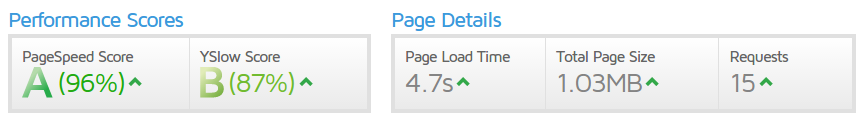
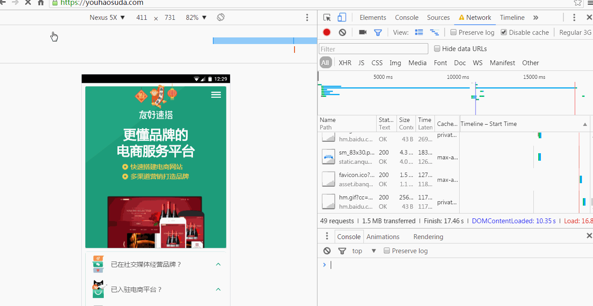
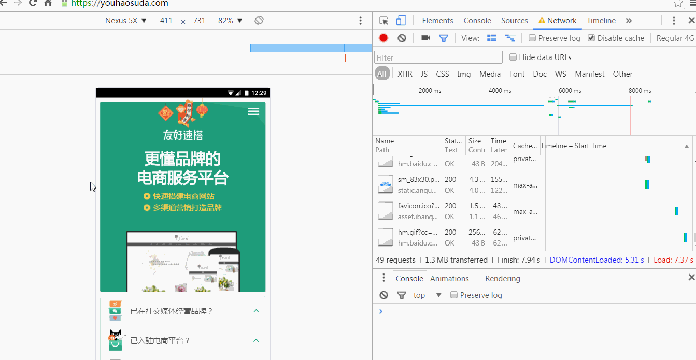
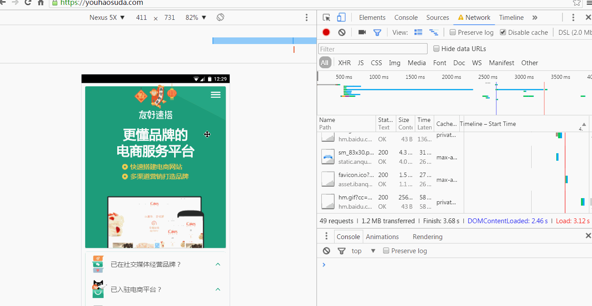

简单探求官网性能
+ [PageSpeed Insights Results](https://developers.google.com/speed/pagespeed/insights/?url=https%3A%2F%2Fyouhaosuda.com%2F&tab=mobile)
+ [GTmetrix](https://gtmetrix.com/reports/youhaosuda.com/mXQQQSKH)

##测试环境：

1. 测试服务器：HK
2. 浏览器：Chrome 36
3. 网络：DSL(1.5Mbps/384 Kbps, 50ms)

##测试结果：



整体上查看，我们官网首页表现很好，就PageSpeed数据得分很高，性能优化方面也很出色，但是结合个人认知，作个简单总结，以备实践。

###1.浏览器缓存

这是属于web服务器端的设置，对没有主机自主权的个体而言，这个总是一个瓶颈，本人的网站在缓存方面也存在很大的问题（购买主机），本站中有4个文件，测试报告推荐使用更长时间的缓存，尤其是其中的flower.png这个基本上属于很少改变的静态文件，可以设置Cache-control值为最大，其中主页的main-md.css应该也可以设置较长时间的缓存的。

###2.避免重定向

###3.优化脚本顺序

为保证css文件的并行下载，建议将css文件置于js文件之前，设置可将非主要内容的js文件置于```</body>```之前。

首页中有5个阻止呈现的脚本和一个css，这会导致首屏不能完整快速的展现，呈现给访问者不好的印象。

###不同网络下的加载简单对比图





<iframe height= 300 width= 100% src="1.mp4" frameborder=0 allowfullscreen></iframe>


